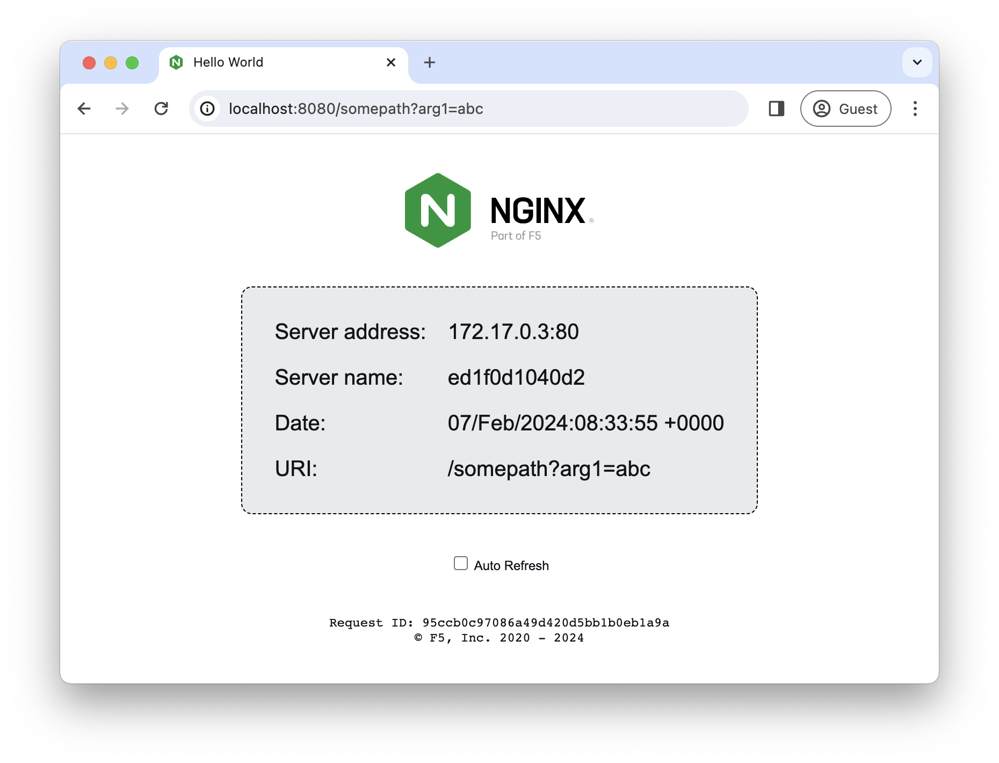

# NGINX webserver that serves a simple page containing its hostname, IP address and port as wells as the request URI, the local time of the webserver and the client IP address.

The image is uploaded to Docker Hub -- https://hub.docker.com/r/nginxdemos/hello/

How to run:
```
$ docker run -P -d nginxdemos/hello
```

Now, assuming we found out the IP address and the port that mapped to port 80 on the container, in a browser we can make a request to the webserver and get the page below: 


The image was created to be used as a simple backend for various load balancing demos.
