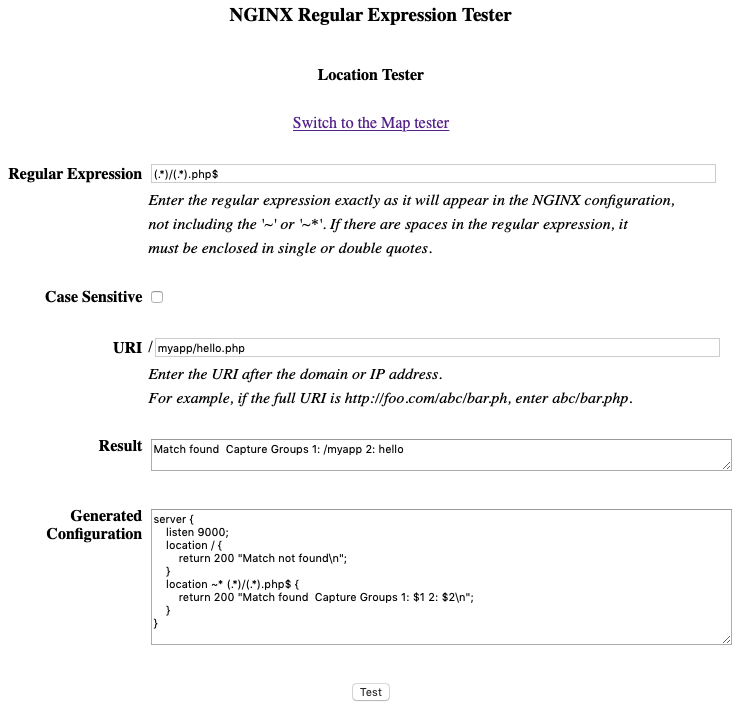
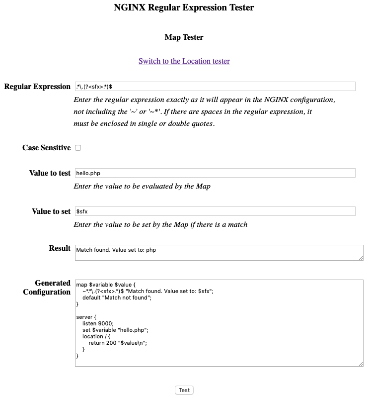

# NGINX Regular Expression Tester

## Overview

Provides a mechanism for testing regular expressions directly within an NGINX configuration.

NGINX Unit is used to serve a PHP page that creates an NGINX configuration to use to test the regular expression.

NGINX and Unit are run together in the same container.

#### Components

**docker-compose.yml:** The configuration file for Docker Compose to build the image and create the container.

**/regextester/Dockerfile:** Creates a Docker image, *regextester* based on the NGINX F/OSS image and adding NGINX Unit.

**/regextester/regextester.conf:** The base NGINX configuration file for this application, proxying requests to NGINX Unit.

```
upstream regextester {
    server 127.0.0.1:8000;
}

server {
    listen 80;
    location / {
        root /usr/share/nginx/html;
    }
    location ~ \.php$ {
        proxy_pass http://regextester;
    } 
}
```

**/regextester/regextester.php:** A page where the user chooses whether the regular expression is for a location or map and then enteres the required values.  The necessary NGINX configuration is generated and NGINX is reloaded.  The regex is then tested and the results displayed.

The format of the NGINX configuration file to be generated depends on whether the regex is to be used in a location or a map.

For a location it will be of the form:

```
server {
    listen 9000;
    location / {
        return 200 "Match not found\n";
    }
    location ~ <regex> {
        return 200 "Match found [Capture Group(s) 1: $i 2: $i ...]\n";
    }
}
```

For example, if the regex is ```(.*)/(.*).php$``` and it is case insensitive the generated configuration file will be:

```
server {
    listen 9000;
    location / {
        return 200 "Match not found\n";
    }
    location ~* (.*)/(.*).php$ {
        return 200 "Match found. Capture Groups 1: $i 2: $2\n]";
    }
}
```
     
Here is a screen shot of the PHP page with the results for the URI */myapp/hello.php*:

---



---

For a map, the NGINX configuration files will be of the form:

```
 map $variable $value {
     ~[*]<regex> "Match found: <value to set>;
     default "No match found:";
 }

 server {
     listen 9000;
     set $variable "<value to set>";
     location / {
        return 200 "$value\n";
    }
 }
```

For example, if the regex is ```\.php$```, the value to test is *hello.php*, the value to set if a match is found is *php* and it is case sensitive, the generated configuration file will be:

```
 map $variable $value {
     ~\.php$ "Match found. Value set to: php";
     default "No match found:";
 }

 server {
     listen 9000;
     set $variable "hello.php";
     location / {
        return 200 "$value\n";
    }
 }
```

If the regex is ```.*\.(?<sfx>.*)$```, the value to test is *hello.php*, the value to set if a match is found is *$sfx* and it is case insensitive, the generated configuration file will be:

```
 map $variable $value {
     ~*.*\.(?<sfx>.*)$ "Match found. Value set to: $sfx";
     default "No match found:";
 }

 server {
     listen 9000;
     set $variable "hello.php";
     location / {
        return 200 "$value\n";
    }
 }
```

Here is a screen shot of the PHP page with the results:

---



---

**/regextester/start.sh:** The start script specified in the Dockerfile to start NGINX and Unit and configure Unit.

**/regextester/unitphp.config:** The Unit configuration

#### Setup

* From /nginx-regex-tester: ```# docker-compose up -d```

#### Running the tester

* Display the web page in a browser: ```http://<docker host name>/regextester.php```

* Enter the required information and press the *Test* button